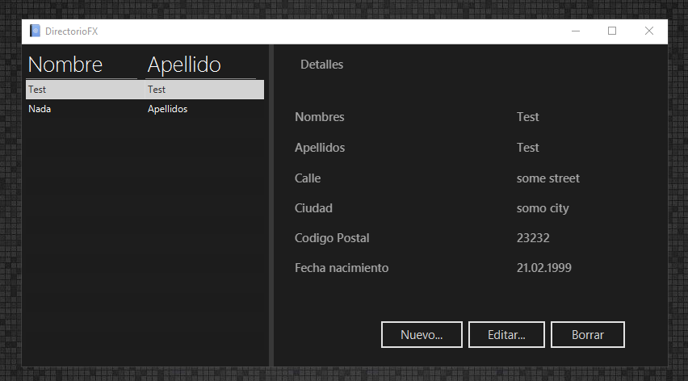
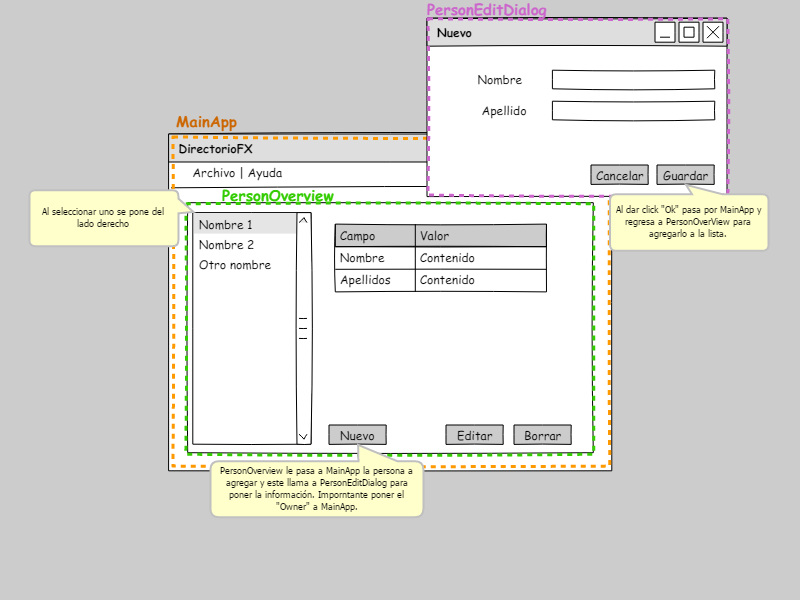

# DirectorioFX

Aplicacion de directorio con ORM Lite como base de JavaFX



Para ejecutar la aplicación es necesario de:

- NetBeans IDE 11+
- JDK 11
- Maven 3+

## Explicación del proyecto

El proyecto esta basado en el tutorial de JavaFX:
[http://code.makery.ch](http://code.makery.ch/library/javafx-8-tutorial/es/).

Una explicación de como viajan las peticiones dentro de la aplicación:



## Ejecucion

Para ejecutar el proyecto en **modo normal** ejecutamos lo siguiente:

```sh
mvn compile
mvn clean javafx:run
``` 
> `F6` desde Netbeans con el archivo `nbactions.xml` ya configurado

Para ejecutar el proyecto en **modo debug** ejecutamos lo siguiente:

```sh
mvn compile
mvn clean javafx:run@debug
``` 
> `Ctrl+F5` desde Netbeans con el archivo `nbactions.xml` ya configurado

 Para mas información visitar el enlace de Stakoverflow: https://stackoverflow.com/questions/56197372/i-cant-debug-an-application-using-netbeans-11-with-javafx-12

## Empaquetar en JAR

Para empaquetar en JAR:

```sh
mvn clean package
# Ejecutar
java -jar target/DirectorioFX-1.0.jar
```
